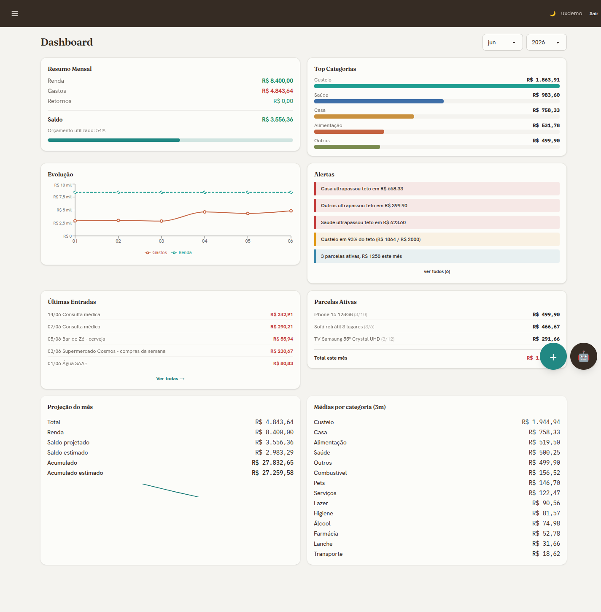

<div align="center">

# 📒 Ledger — AI-Powered Personal Finance Tracker

**A full-stack personal finance platform with a conversational AI assistant that reads your voice notes and receipt photos, understands your spending, and keeps the books for you.**

Built as a real, daily-driven app to manage a family's finances — installed as an Android app, used every day, and running in production.

[](https://www.python.org/)
[](https://www.djangoproject.com/)
[](https://react.dev/)
[](https://ai.pydantic.dev/)
[](https://tailwindcss.com/)
[](#-quality--testing)
[](#-deployment)

</div>

---

## ✨ Overview

**Ledger** is a monolithic-but-modern Django application that replaced a tangle of spreadsheets for tracking real household expenses. It blends server-rendered simplicity with focused interactivity: **HTMX** drives the CRUD-heavy pages while **React islands** power the analytics dashboard and the AI chat widget. At its core is a **PydanticAI agent** that turns natural language, voice notes, and photographed receipts into structured, categorized ledger entries.

The product UI is in **Brazilian Portuguese** (R$, pt-BR conventions, credit-card invoice cycles), but the codebase, architecture, and this document are in English.



> The monthly dashboard: summary KPIs, top categories, spend evolution, budget alerts, active installment plans, run-rate projection, and 5-month category averages — all composed from modular React cards over a DRF API.

---

## 🎯 Highlights

- **🤖 Conversational bookkeeping** — Tell the assistant *"gastei 45 no mercado no crédito"* and it resolves the category, payment method, and billing month, then proposes an entry before saving.
- **🧾 Receipt OCR** — Snap a photo of a supermarket receipt; a vision model extracts line items, the backend deterministically prorates discounts in Python (the split always sums to the amount paid), and items are grouped by category for one-tap confirmation.
- **🎙️ Voice notes** — Record a voice memo; it's transcribed and routed through the same registration flow. Media is processed and discarded — never persisted.
- **🧠 Semantic memory** — User-specific rules ("cigarettes → Álcool category") stored as `pgvector` embeddings so the assistant remembers preferences across sessions.
- **📅 Monthly cockpit** — A per-month control panel for income, recurring/systematic expenses, installment plans, and credit-card due dates.
- **📊 Live analytics dashboard** — React + Recharts cards with KPIs, evolution charts, budget alerts, projections, and a what-if simulator.
- **📥 CSV importer** — A 4-step wizard (upload → column mapping → preview with conflict resolution → bulk import) for migrating historical data.
- **📱 Installable everywhere** — A PWA (offline fallback, service worker, generated icons) wrapped as an Android **TWA** and used as a native-feeling app.

---

## 🏗️ Architecture

A deliberately **hybrid** design — the lightest tool for each job, one deployment to operate.

```
┌─────────────────────────────────────────────────────────────────────┐
│                          Browser / Android TWA                        │
│                                                                       │
│   HTMX + Alpine.js pages          React 18 islands (Vite)             │
│   (entries, cockpit, importer,    (dashboard cards, AI chat widget)   │
│    settings, consolidated)                │                           │
└───────────────┬───────────────────────────┬──────────────────────────┘
                │ server-rendered HTML        │ JSON / SSE
                ▼                             ▼
┌─────────────────────────────────────────────────────────────────────┐
│                         Django 6 (ASGI, Gunicorn + Uvicorn)           │
│                                                                       │
│   finances app        assistant app              core app             │
│   • models/services   • PydanticAI agent         • auth (CustomUser)  │
│   • billing logic     • tools (register/query/   • PWA (manifest/SW)  │
│   • cockpit/budgets     analytics/memory)        • TWA asset links    │
│   • DRF API           • receipt + voice pipeline • healthz            │
└───────────────┬───────────────────────────────┬──────────────────────┘
                │                                 │
                ▼                                 ▼
   ┌──────────────────────────┐      ┌────────────────────────────────┐
   │ PostgreSQL + pgvector     │      │ OpenAI (LLM / vision /          │
   │ (semantic AI memory +     │      │ transcription / embeddings)     │
   │  all financial data)      │      │ — provider-agnostic via         │
   └──────────────────────────┘      │   PydanticAI                    │
                                      └────────────────────────────────┘
```

**Why this shape?** Most pages are simple CRUD — HTMX keeps them server-rendered with near-zero JS maintenance. Only the dashboard and chat need rich interactivity, so React is scoped to those islands. A single Django process keeps Cloud Run operations trivial.

### The AI assistant

The assistant is a **single PydanticAI agent** (currently `gpt-5.4`, but provider-agnostic) with a focused tool belt rather than a heavyweight multi-agent crew — a design that was consolidated from an earlier orchestrator + sub-agents setup after measuring the token cost of multi-agent fan-out. Tools include:

| Domain | Capabilities |
|---|---|
| **Registration** | create / update / delete entries, name-lenient category & payment-method resolution, credit-card billing-month computation |
| **Receipts** | propose → confirm → commit-once flow, deterministic discount proration, store inference, per-item categorization by index |
| **Queries** | expenses, balances, budget status, installment plans |
| **Analytics** | category breakdowns, month-over-month comparison, run-rate projection, anomaly & proactive-trigger detection (all math done in Python, not the LLM) |
| **Memory** | look up / create / list user rules, matched via `pgvector` semantic search |

Key principle: **the LLM decides intent; deterministic Python does the arithmetic.** Money is never trusted to a language model.

---

## 🛠️ Tech Stack

| Layer | Technologies |
|---|---|
| **Backend** | Python 3.12, Django 6, Django REST Framework, ASGI (Gunicorn + Uvicorn worker) |
| **Frontend** | HTMX, Alpine.js, React 18 + Vite, TailwindCSS v4, DaisyUI, Recharts |
| **AI** | PydanticAI (provider-agnostic), OpenAI (chat, vision, transcription, embeddings) |
| **Data** | PostgreSQL + `pgvector`, Pillow (receipt image preprocessing) |
| **Tooling** | `uv` (packaging), Ruff (lint + format), pytest + pytest-django + pytest-bdd, model-bakery, coverage, pre-commit |
| **Delivery** | Docker, WhiteNoise, PWA (manifest + service worker), TWA (Bubblewrap), GitHub Actions CI |
| **Production** | Google Cloud Run, Supabase (Postgres + pgvector), Secret Manager |

---

## 🚀 Getting Started

### Prerequisites

- [`uv`](https://docs.astral.sh/uv/) (Python package manager)
- Docker (for the local PostgreSQL + pgvector database)
- Node.js + a package manager (for building the React/Tailwind frontend assets)
- An OpenAI API key (for the AI assistant features)

### 1. Clone & configure

```bash
git clone <your-repo-url> expense_tracker_v2
cd expense_tracker_v2

cp .env.example .env
# edit .env — at minimum set SECRET_KEY and LLM_API_KEY
```

### 2. Start the database

```bash
docker compose up -d        # PostgreSQL 16 + pgvector on port 5432
```

### 3. Install dependencies & migrate

```bash
uv sync                                         # backend deps
uv run python src/backend/manage.py migrate     # create schema (pgvector enabled via migration)
uv run python src/backend/manage.py createsuperuser
```

### 4. Build frontend assets

```bash
# React islands (Vite) + Tailwind CSS
uv run python src/backend/manage.py tailwind build --force
# build the React bundle per the frontend toolchain (mount.js)
```

### 5. Run

```bash
uv run python src/backend/manage.py runserver
# http://localhost:8000
```

> 💡 The assistant works without media features if you only set a text LLM; voice and receipt OCR require the vision/transcription model env vars (see `.env.example`).

---

## ✅ Quality & Testing

This project is built **test-first** — TDD is non-negotiable, and every feature lands with its tests.

```bash
uv run pytest src/backend/ -v              # run the full suite (766 tests)
uv run coverage run -m pytest src/backend/ # with coverage
uv run coverage report --fail-under=80     # enforce ≥80% coverage
uv run ruff check src/backend/             # lint
uv run ruff format --check src/backend/    # format check
```

- **766 tests** across unit, integration, and BDD scenarios (`pytest-bdd`).
- **GitHub Actions CI** runs lint, format check, the full suite with an ≥80% coverage gate, and `manage.py check` on every push and PR.
- **Ruff** enforces a strict rule set including `flake8-django`, `flake8-bandit` (security), `pyupgrade`, and `isort`.
- **Pre-commit hooks** keep the working tree clean.

---

## ☁️ Deployment

Production runs on **Google Cloud Run** with a **Supabase** Postgres + pgvector database.

- Containerized with a multi-stage **Dockerfile**; served over **ASGI** for Server-Sent Events (streaming chat).
- Static assets via **WhiteNoise** (Brotli compression).
- Secrets (Django key, database URL, LLM key) injected from **Secret Manager**.
- Security hardening (HSTS, secure cookies, `nosniff`) gated behind `DEBUG=False`.
- Deployed straight from source: `gcloud run deploy --source .`.

The same web app is installable as a **PWA** and ships as an Android **Trusted Web Activity** (`com.bessavagner.ledger`), verified via Digital Asset Links served from `/.well-known/assetlinks.json`.

---

## 📂 Project Structure

```
expense_tracker_v2/
├── src/backend/
│   ├── config/            # Django settings, URLs, ASGI
│   ├── core/              # auth (CustomUser), PWA, TWA asset links, healthz
│   ├── finances/          # models, services, billing logic, DRF API, views
│   │   ├── models/        # Entry, Income, Category, PaymentMethod, Budget,
│   │   │                  #   InstallmentPlan, SystemicExpense, ...
│   │   ├── services/      # billing, projections, systemic/installment months
│   │   └── views/         # entries, cockpit, dashboard, importer, settings
│   ├── assistant/         # the AI layer
│   │   ├── agents/        # PydanticAI agent, tools, prompts, analytics, OCR
│   │   └── services/      # embeddings, image prep, transcription
│   ├── frontend/src/      # React islands (dashboard cards + ChatWidget)
│   └── templates/         # HTMX-driven pages (Django templates)
├── docs/                  # specs, plans, deploy runbooks
├── Dockerfile
├── compose.prod.yml
├── docker-compose.yml     # local Postgres + pgvector
└── pyproject.toml
```

---

## 💡 Engineering Notes

A few decisions worth calling out:

- **Deterministic money.** Credit-card billing months, discount proration, and projections are computed in Python and unit-tested — the LLM only proposes structured intent that the backend validates and commits.
- **One pending draft invariant.** The receipt flow guards against a real-world double-registration bug by ensuring a user can only ever have one pending draft, discarded on commit or when a new photo arrives.
- **Privacy by default.** Voice and image media are processed and immediately discarded; only the resulting structured entries are stored.
- **Provider-agnostic AI.** PydanticAI means the model can be swapped (OpenAI today, Claude tomorrow) via a single environment variable.
- **Real-world driven.** Nearly every feature traces back to actual daily use — the changelog reads like a field journal of a tool someone genuinely depends on.

---

<div align="center">

Built with care by **Vagner Bessa** · Powered by Django, React & PydanticAI

</div>
