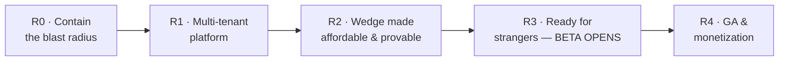
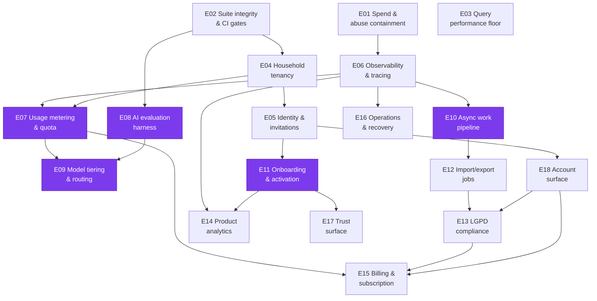

# Ledger Product Backlog — Single-User Tool → Ready-to-Market MVP

**Created:** 2026-08-07
**Baseline commit:** `3bbc5ca`
**Source of truth for architecture:** [`docs/architecture/product-readiness-review.md`](../architecture/product-readiness-review.md)

This backlog is written to be **consumed by AI agents**. Every epic file is self-contained: an agent opens exactly one file and has the outcome, the codebase evidence, the acceptance criteria, the verification commands, and the skill pipeline to run. No epic requires reading another epic to be actionable.

No story points. No timeframes. Releases are **gates**, not dates — a release opens when its epics' Definitions of Done pass.

---

## 1. Product decisions this backlog encodes

These were decided during brainstorming and are **not** open for re-litigation inside an epic. If an epic seems to contradict one, the decision wins.

| # | Decision | Consequence for the backlog |
|---|---|---|
| PD-1 | **The wedge is AI-first capture.** Conversational, voice, and receipt-OCR entry is the product, not a feature. | Open Finance auto-sync is explicitly **out of scope for MVP** (see §2). Epics that improve capture quality are wedge-critical and marked as such. |
| PD-2 | **Household tenancy from day 1.** | E04 is the largest epic and lands before any external user. Every subsequent epic assumes `request.household`, not `request.user`. |
| PD-3 | **Free capped beta → paid at GA.** | Metering and quotas ship in R1 (enforced, not charged). Billing lands in R4. |
| PD-4 | **Migrate to cheaper models, proven by evaluation.** | E08 (eval harness) gates E09 (model routing). A model swap without a score is forbidden. |
| PD-5 | **Backlog lives as repo markdown, mirrored to GitHub Issues.** | This directory is canonical. Issues are a view. Remote: `bessavagner/expense_tracker_v2`. |

### 2. Why Open Finance is out of scope (recorded so it stays settled)

The Brazilian incumbents sync 200+ institutions automatically: **Mobills at R$119,90/year** (~R$10/mo), Organizze on its paid plan. The aggregators that enable it cost **Pluggy ~R$2.500/mo, Belvo ~R$6.000/mo, Tecnospeed R$1.500 setup + R$540/mo**. At Mobills' price point that is ~250 paying subscribers just to clear Pluggy's floor, before OpenAI, Cloud Run, or Supabase.

**Ledger competes where Open Finance is structurally blind.** A bank feed yields `PAGUE MENOS R$87,43`. Ledger yields eleven items across four categories, with the discount prorated so the split sums to the amount paid. Same for the credit-card invoice cycle: Open Finance reports a transaction date; Brazilian users budget by *billing month*, which depends on the card's closing day.

Revisit only when MRR covers an aggregator floor with margin. Tecnospeed is the cheapest entry if that day comes.

---

## 3. Release map



| Release | Gate — the release opens when this is observably true |
|---|---|
| **R0 · Contain the blast radius** | An authenticated stranger cannot generate unbounded LLM spend, cannot write via an unprotected endpoint, and CI is green. |
| **R1 · Multi-tenant platform** | Two people share one ledger. A stranger can sign up, verify email, and reset a password. Every LLM call has a cost record attributed to a household. Production failures page you, not the customer. |
| **R2 · Wedge affordable & provable** | Receipt and chat quality are *scored* against real fixtures across models, and the production model mix costs a measured fraction of `gpt-5.4` with no score regression beyond an agreed threshold. |
| **R3 · Ready for strangers — BETA OPENS** | A new user reaches the activation event unaided. Import and export are durable. A data-subject request can be fulfilled in 15 days and a deletion honoured. Activation and D7 retention are instrumented. |
| **R4 · GA & monetization** | Someone pays in BRL, is charged correctly, hits a quota gracefully, and you can restore the database inside your stated RTO — rehearsed, not assumed. |

**R3's gate is half open as of 2026-08-16.** Two of its four conditions are
observably true: *a new user reaches the activation event unaided* — proven by
the E11 walkthrough, activation in 83 seconds with no help
(`docs/superpowers/evidence/e11-walkthrough/README.md`) — and *activation and D7
retention are instrumented*, by E14. The two that remain are **durable import and
export (E12)** and **a data-subject request fulfilled in 15 days with deletion
honoured (E13)**. Beta does not open until all four hold.

E12's third condition is **code-complete but not yet true in production**: the
import/export machinery, its tests and its runbook all landed on 2026-08-16
(footnote 12), and what stands between that and a ticked box is provisioning the
GCS bucket and redeploying with `GS_BUCKET_NAME` set. E13 remains `blocked`
regardless — it depends on **E18** as well, and E18 is `ready` rather than
`done`.

**R2's gate is observably true as of 2026-08-15.** Receipt and chat quality are
scored against fifteen real receipts and seven conversations across five models
(E08, E09), and the production vision mix measures **3.75× cheaper** than
`gpt-5.4` with no regression at all — it scores *higher*, 0.719 against 0.699,
with the money invariant improving from 0.711 to 0.756. E10 (async work
pipeline) is still open inside R2 but is not named by this gate.

---

## 4. Epic index

`W` = wedge-critical (directly serves PD-1). Status starts `ready` for epics with no unmet dependency, `blocked` otherwise.

| ID | Epic | Rel | W | Depends on | Status |
|---|---|---|---|---|---|
| [E01](E01-spend-and-abuse-containment.md) | Spend & abuse containment | R0 | | — | **done** (2026-08-14) |
| [E02](E02-suite-integrity-and-ci-gates.md) | Suite integrity & CI gates | R0 | | — | **done** (2026-08-11) |
| [E03](E03-query-performance-floor.md) | Query performance floor | R0 | | — | review |
| [E04](E04-household-tenancy.md) | Household tenancy | R1 | | E02 | **done** (2026-08-13) |
| [E05](E05-identity-invitations-admin-isolation.md) | Identity, invitations & admin isolation | R1 | | E04 | **done** (2026-08-14) |
| [E06](E06-observability-and-agent-tracing.md) | Observability & agent tracing | R1 | | E01 | **done** (2026-08-14) |
| [E07](E07-usage-metering-and-quota.md) | Usage metering & quota | R1 | W | E04, E06 | **done** (2026-08-14)² |
| [E08](E08-ai-evaluation-harness.md) | AI evaluation harness | R2 | W | E02 | **done** (2026-08-14)³ |
| [E09](E09-model-tiering-and-routing.md) | Model tiering & routing | R2 | W | E07, E08 | **done** (2026-08-15)⁴ |
| [E10](E10-async-work-pipeline.md) | Async work pipeline | R2 | W | E06 | **done** (2026-08-15)¹¹ |
| [E11](E11-onboarding-and-activation.md) | Onboarding & activation | R3 | W | E05 | **done** (2026-08-16)⁹ |
| [E12](E12-durable-import-export-jobs.md) | Durable import/export jobs | R3 | | E10 | **review** (2026-08-16)¹² |
| [E13](E13-lgpd-compliance.md) | LGPD compliance | R3 | | E12, E18 | blocked |
| [E14](E14-product-analytics.md) | Product analytics | R3 | | E06, E11 | **done** (2026-08-16)¹ |
| [E15](E15-billing-and-subscription.md) | Billing & subscription | R4 | | E07, E13, E18 | blocked |
| [E16](E16-operations-staging-deploy-recovery.md) | Operations: staging, deploy, recovery | R4 | | E06 | ready |
| [E17](E17-trust-surface.md) | Trust surface: audit, error UX, landing | R4 | | E11 | ready |
| [E18](E18-account-surface.md) | Account surface (Conta) | R3 | | E05 | ready |

### Defects

Numbered `D` and kept in the same self-contained format. A defect earns a file
when it changes what another epic should do; anything smaller is a commit.

| ID | Defect | Rel | W | Depends on | Status |
|---|---|---|---|---|---|
| [D01](D01-behaviour-harness-omits-the-receipt-draft.md) | Behaviour harness omits the `ReceiptDraft`, making receipt cases unpassable | R2 | W | E08 | **done** (2026-08-15)⁵ |
| [D02](D02-name-resolution-is-accent-sensitive.md) | Name resolution is accent-sensitive, so "Crédito C6" cannot find "Credito C6" | R2 | W | — | **done** (2026-08-15)⁶ |
| [D03](D03-cost-report-ignores-cached-input-tokens.md) | The cost report bills cached input tokens at full price, so every USD figure is too high | R2 | | E07 | **done** (2026-08-15)⁷ |
| [D04](D04-asgi-lifespan-error-on-every-cold-start.md) | Every cold start reports a `ValueError` to Sentry because the lifespan scope reaches Django | R2 | | E06 | ready⁸ |
| [D05](D05-a-backdated-receipt-activates-into-an-invisible-month.md) | A backdated receipt activates the user into a month they are not looking at | R3 | W | E11 | **done** (2026-08-16)¹⁰ |

### Dependency graph



**Critical path to beta:** `E02 → E04 → E05 → E11`. Everything else can proceed alongside it. **E03 and E01 are independent of everything** — start there for immediate risk reduction with no coordination cost.

² **E07 closed 2026-08-14 with one box unticked**, audited against `main` after the
E08 merge. Ten of eleven assertions map to named tests, listed inline in the epic.
The open one is *"the operator report shows p50/p90/p99 against real beta data"*:
the command, the percentiles and the per-kind breakdown all exist, but there is no
beta data yet, so the percentiles describe one household. Not a code gap. It closes
when the beta has run, which is also when the number is actually needed (to set a
price before GA). Same shape as E06's three open boxes.

³ **E08 closed 2026-08-14 with one box unticked.** The dataset has seven receipt
cases against a DoD of ten: only seven distinct receipts exist, and padding the set
would corrupt the baseline it produces. Baseline recorded for `openai:gpt-5.4` at
`docs/superpowers/evidence/eval/baseline-2026-08-14.md` (extraction 0.886 over five
runs, behaviour 0.810 over three). The harness paid for itself on its first real
run by refuting the gpt-5.6 swap staged mid-epic and by finding two provider
refusals that no test could reach.

⁵ **D01 closed 2026-08-15, with a corrected root cause.** The write-up blamed a
missing `ReceiptDraft`; `build_world` already created it. The real blocker was that
the fixture's items carried no category, so `propose_receipt` refused the very tool
the photo turn instructs the agent to call. A stub test now walks propose → commit
with no provider, so the case is provably passable for free.

⁷ **D03 was found by comparing the report with the provider's bill.** E09
reported ~$11 of spend for a session that actually cost **$2.54**. `cost_usd_for`
prices every input token at the full rate, but `input_tokens` *includes* cached
ones — measured at 47% of the prompt on a repeated read — and `ModelPrice` has no
cached rate. The error is always in the same direction (over-report), which is
safe for E01's ceiling and wrong for E07's report. **E09's 3.75× factor stands**:
both sides were measured identically, and the cheap model has *more* to gain from
caching than the one it beat. Distrust the absolute $/sweep, not the ratio.
Nothing in the repo could have caught this — every test checks our arithmetic
against our own inputs, and the arithmetic was self-consistent. **Shipped
2026-08-15:** `ModelPrice.cached_input_per_mtok` seeded from the live pricing
pages, `cost_usd_for` splitting the prompt into fresh and cached halves,
`UsageRecord.cache_read_tokens` for auditability, and a `Cached` column in the
eval table — the E09 ratios were unaffected and the evidence documents were
annotated rather than re-measured.

⁹ **E11 closed 2026-08-16, and the walkthrough is why.** Every machine-checkable
assertion passed first — 1787 tests, coverage 92% against a gate of 80%, lint
clean, migrations reversible and rehearsed — but the epic said in its own words
that a passing suite is not the evidence. The evidence: a first-time user on an
Android phone reached activation in **83 seconds** from the guided setup,
filling in every step, and one supermarket coupon became three correctly-split
entries. Record at `docs/superpowers/evidence/e11-walkthrough/`.

Two honest qualifications. **One hint was given** — the local `.env` had
`EMAIL_HOST` empty, so verification went to the console backend and the
confirmation link was handed over; everything after the guided setup was
unaided. That also means E05's open question — whether a mandatory-verification
wall costs activation for someone waiting on real email — is **still
unanswered**, and the **skip paths were never exercised by a human**.

**The walkthrough earned its keep by finding D05** (below), which no test could
have found: the wedge worked and then looked like it hadn't.

Two things this epic learned that outlive it. First, **the activation event is
household-scoped and an invited member has two households** — their own,
auto-created and never used, and the inviter's, where they work. That is
pre-existing tenancy behaviour, and it means E14's S14-1 open question ("does
an invited member count as a separate activation?") should be answered from
that fact rather than guessed; it is written down in
`docs/architecture/activation-event.md`. Second, **`PROJECTION_ORIGIN_MONTH`
is now per household** and the env var only seeds a one-time backfill — the
old global floor silently discarded imported history, so a CSV of 2024 landed
below it and vanished from the acumulado.

¹⁰ **D05 was found by a stranger, not by a test, and that is the point.** The
participant photographed a coupon dated 2023-06-04. Extraction read the date
correctly, the split was correct, `billing_month` computed to 06/2023 correctly
— and the dashboard shows the *current* month, so a successful activation
presented as an empty screen. 114 seconds later they hand-created an entry in
the current month that nobody had asked for. Every layer behaved as designed
and the user still concluded it had failed. The date logic must not change
(overriding it with today is the frozen-`billing_month` bug this codebase
already paid to fix); what is missing is telling the user where the receipt
went. Wedge-critical, because a first capture that appears to do nothing
teaches a new user that the wedge does not work.

**Closed 2026-08-16** by
`docs/superpowers/plans/2026-08-16-D05-backdated-receipt-visibility.md`, and it
changed what the user is *told*, never where the row goes. Three surfaces: the
proposal now names a past invoice and asks about it before writing, on the
"Confirma?" turn that already existed; the confirmation names the month and links
to it for any month that is not the current one; and a new
`GET /api/dashboard/ledger-elsewhere/` lets the empty state tell "you have
recorded nothing" apart from "nothing in *this* month", naming the nearest month
that has data. All three read the invoice month from one module that calls
exactly what `Entry.save()` calls — two derivations would have put a month on the
screen the database disagreed with, which is worse than the defect. Both open
questions are answered in the spec rather than deleted. Not fixed, and
deliberately: the year selector still cannot reach 2023, which is **D06**.

**Found on the way, not fixed here (belongs to E02):**
`finances/tests/test_entries_live_summary.py:135,178` pair an unfrozen
`date.today()` with a hardcoded `date(2026, 6, 1)` literal — the same
time-bomb shape global constraint 10 forbids. It predates E11 and no E11 task
touches that file, so repairing it here would have been scope creep.

⁸ **D04 was found by looking at Sentry for the first time in a day.** Checking
that the 2026-08-15 schema-drift outage had reported correctly (it had — 7
events, matching the 7 5xx exactly) surfaced a second issue that had been
firing unnoticed: every cold start reports a `ValueError` because uvicorn's
`lifespan` scope reaches Django through the E01 body-ceiling wrapper. Nothing
breaks — uvicorn swallows it — but it is recurring noise in the tool whose job
is to say when something is wrong, and it is exactly what trains an operator to
skim the issue list. The same session closed E06's long-open "an exception
raised inside the container reaches Sentry" box on real evidence, and filed
**E16 S16-8/S16-9** for the two monitoring gaps the outage exposed.

⁶ **D02 was found by E09's re-baseline, not by review.** `_resolve_by_name` was
case-insensitive but accent-**sensitive**, so a model writing `Crédito C6` — correct
Portuguese — could not find a row stored `Credito C6`, and the user got an error
naming a list that visibly contained what they asked for. A production bug on the
main path: a household that stored `Alimentação` could not type `alimentacao` from a
phone keyboard. With D01 and D02 both fixed, `gpt-5.4` scores **1.000 (7/7)** on the
behavioural suite where E08 measured 0.810 — that number was never about the model.

⁴ **E09 closed 2026-08-15 with one box unticked.** Vision now reads every receipt
on `openai:gpt-5.6-luna` and escalates the ~1/3 it cannot reconcile to
`openai:gpt-5.4-mini`. Measured **3.75× cheaper** than `gpt-5.4` — and *better*, at
0.719 against 0.699, with the money invariant improving from 0.711 to 0.756. Neither
model clears the bar alone; the composition does, which is why S09-3 insists the
pipeline's score is what ships. Evidence:
`docs/superpowers/evidence/eval/matrix-2026-08-15.md`.

**Text stays on `gpt-5.4`, deliberately.** Both cheaper candidates were 0.952 against
its 1.000, failing the category-split case one run in three — the transcript of the
production bug this product exists to prevent. `luna` is as good as `mini` on text
and 3.4× cheaper again, which is the measured answer if E10 ever needs a better
degraded tier.

**Deployed 2026-08-15** as revision `expense-tracker-00046-l64`, verified live. The
deploy also carried **nine unshipped migrations**: E07's entire metering schema
(`ModelPrice`, `UsageRecord`, the credit tables) had never reached production, so the
cost ledger E07 delivered had been recording nothing. Worth checking on any epic
closed by audit rather than by deploy.

The one unticked box is the literal *"proven by changing it against a deployed
revision"*. The mix went live because the service had no `LLM_VISION_MODEL` set, so
the code defaults applied — the env-var override itself is still unexercised and the
documented rollback is unrehearsed.

The advice this footnote used to carry was followed first: the dataset went 7 → 15
cases and the spread halved (0.14 → 0.068) before any candidate ran.

¹ **E14 is `ready` by operator override (2026-08-14).** Its `depends_on` names E11,
which is still `ready` rather than `done`. The override is deliberate: E14's
*instrumentation* half depends only on E06, which is done. Its *activation-metric*
half genuinely needs E11's activation event definition, so an agent starting E14
before E11 lands must stop at that boundary rather than invent the event.

**Closed 2026-08-16**, and it turned out to be an extension rather than a build:
E11 had already shipped most of S14-2 — `ProductEvent`, `emit`/`emit_once`, a
six-name funnel, `activation_report`, and a written activation definition. E14
added three events (`entry_created` at all four write paths, `email_verified`,
`receipt_photo`), one metrics module both readers share (`core/metrics.py`, so
"D7 retention" cannot mean one thing on a terminal and another in a browser),
`manage.py retention_report`, a staff-only `/metricas/`, a `Feedback` model, and
the two documents the numbers are worth nothing without —
`docs/architecture/product-metrics.md` and `ga-criteria.md`, the latter written
before any beta data existed, which is the whole point of S14-6.

**One DoD box is deliberately unticked:** *"Real numbers from actual beta users
are visible, not just an empty dashboard."* Every surface runs and reports today;
what it reports is one household, because that is who has used it. No amount of
code satisfies that assertion — it waits on beta traffic, exactly as the spec's
own skill pipeline says (*the evidence is real beta numbers, not a working
dashboard*).

**A constraint the spec did not anticipate, resolved rather than fudged:**
`ProductEvent.household` is non-null, so pre-signup steps cannot be events at all
— a visitor who has not signed up has no household, and modelling them would mean
nullable-household events, breaking the scoping base class every other read
depends on. **Exposure** is therefore defined now and measured at the edge (Cloud
Run request counts on the signup URL) when E17 ships a landing page. Recorded as
knowingly unmeasured rather than reported as zero.

**E06 is done, so E07, E10, E14 and E16 are all open.** E06 closed with three
DoD boxes unticked — see its closing note; they need a real production error and
a real alert, neither of which is manufacturable on demand. Two of those gaps
(assistant turns/day, LLM spend/day on the golden-signals dashboard) are
*structurally* E07's work, not E06 debt.

¹¹ **E10 was done on 2026-08-15 and the status was never flipped** — the merge
is `99aa66c`, and `core/tasks/` (auth, backends, cloud, enqueue, execution,
registry, views) has been on `main` since. Corrected 2026-08-16.

**It shipped the rails only, and its own DoD says so.** Cloud Tasks caps a task
at **1 MiB**, a fixed system limit, so audio (25 MB) and prepared receipt JPEGs
(several MB) cannot move off-request until E12 lands object storage. Two
Observable assertions are therefore ticked as **deferred to E12** rather than
done — the one-pending-draft invariant under concurrent uploads, and a retried
transcription. The one workload actually moved is memory-rule embedding, and
moving it exposed that `create_memory_rule` had **never** generated an
embedding: `MemoryEmbedding` was empty outside `seed_perf_data`, so semantic
recall was searching nothing. Pre-E10 rules still have no vector and a backfill
command needs its own ticket.

**Not provisioned:** the GCP queue, service account and IAM. Local mode is
`CLOUD_TASKS_ENABLED=0` (eager, in-process). `docs/runbook.md` → *Async tasks
(E10)* has the `gcloud` commands.

¹² **E12's code is complete and its DoD commands pass** (2026-08-16): 1965 tests
pass, coverage 93% against the 80 gate, `ruff` clean, `makemigrations --check`
clean, `check --deploy` unchanged. **The bucket was provisioned the same day** —
`gs://ledger-jobs-expense-tracker-482807`, uniform bucket-level access, public
access prevention *enforced*, a 7-day delete rule, and `objectAdmin` for the
Cloud Run runtime identity, all confirmed by `buckets describe`.

It sits at `review` rather than `done` for what is left: **the production
migration and the redeploy have not been run.** `0020` renames
`finances_importbatch` → `finances_importjob` on a table holding real import
records, and the deployed revision (00047) still queries the old name, so the
two steps go back to back. Until they do, production writes job files to the
instance's own filesystem — which works, and silently loses them on the next
revision. Flip to `done` after one live import and one live export round-trip
against the new revision. `docs/runbook.md` → *Import and export jobs (E12)* has
the commands.

What shipped: `ImportBatch` → `ImportJob` by `RenameModel` (production rows
intact, reversible, verified forward-back-forward); the wizard's state out of
the session and into the job row plus object storage, so any instance can serve
any step (**B4**); a savepoint per row, so one rejected row fails alone
(**H5**) — proved by removing it and watching the suite fail with
`TransactionManagementError`; execution off-request via `core.tasks`, with HTMX
progress, a pt-BR failure message, a `sweep_stuck_import_jobs` command and a
per-row failure report as CSV; a history page; and a full household export
behind an application-signed 1-hour link, round-tripped back into a fresh
household with matching totals *and* matching per-category splits.

**Two latent defects the work surfaced, both pre-existing, both fixed.**
Duplicate detection had **never** worked: `parse_csv_rows` stores a row's date
as an ISO string while `values_list` returns a `datetime.date`, so the tuple
comparison never matched and every re-uploaded file looked entirely new. That is
load-bearing for this epic — "send the file again, the rows you already have
will be marked duplicate" is the recovery offered after a failed or interrupted
import. And the preview's "Pular" checkboxes sat outside any `<form>`, so a skip
could never be submitted at all. Separately, the export round-trip found a real
importer bug: a BOM-prefixed header (which is every CSV Excel writes, including
our own exports) made the date column silently fail to auto-detect.

**One accepted bound, written down before it is an incident:**
`core/tasks/views.py` holds `select_for_update` on the `TaskRun` row for the
whole handler, so one import holds one row lock for its run. At the 2 MB cap
that is well inside Cloud Run's 300 s timeout; chunked execution is the fix if a
real user ever hits it, and it is out of scope here.

**E05 is done, so E11 and E18 are both open.** E18 is small and off the critical path — it can run alongside E11 rather than ahead of it. Its `blocks` edges into E13 and E15 are *UI-surface* dependencies, not data ones: both later epics add a tab to E18's page instead of inventing an account surface of their own.

---

## 5. Epic file contract

Every `E**.md` in this directory has these sections, in this order. An agent can rely on them existing.

| Section | Purpose |
|---|---|
| YAML frontmatter | `id`, `title`, `release`, `status`, `depends_on`, `blocks`, `wedge_critical` |
| **Outcome** | One sentence, observable, in user or operator terms. Not a task list. |
| **Why now** | The forcing function. Cites the review finding ID (B1, H3, M4…). |
| **Evidence in the codebase** | `file:line` anchors, verified at commit `3bbc5ca`. Saves the agent a discovery pass. |
| **Stories** | `S<epic>-<n>`, each with Given/When/Then acceptance criteria. |
| **Definition of Done** | **Commands that must pass**, plus observable assertions. Not prose. |
| **Out of scope** | What an agent must NOT drag in. Prevents scope creep. |
| **Open questions** | Decisions the agent must surface rather than guess. |
| **Skill pipeline** | The exact skills to invoke, in order. |

### Status values

`ready` (dependencies met, may start) · `blocked` (dependency unmet) · `in-progress` · `review` (DoD passing, awaiting review) · `done`.

Update the epic's frontmatter **and** the table in §4 when status changes.

---

## 6. How an agent works an epic

```
1. Read docs/backlog/E<NN>-*.md            — the whole epic, one file
2. Read docs/architecture/product-readiness-review.md § cited by "Why now"
3. Confirm every depends_on epic is `done`  — if not, STOP and report
4. Run the epic's Skill pipeline, in order
5. The epic is done when its Definition of Done commands pass — no "should work"
```

### Default skill pipeline

Most epics use this. Deviations are stated in the epic's own **Skill pipeline** section.

| Step | Skill | Why |
|---|---|---|
| 1 | `superpowers:brainstorming` | **Only if the epic's Open questions are unresolved.** Otherwise skip — the epic *is* the spec. |
| 2 | `superpowers:writing-plans` | Turns the epic into `docs/superpowers/plans/YYYY-MM-DD-<epic>.md`. This is the existing convention — 20+ plans already there. |
| 3 | `superpowers:using-git-worktrees` | Isolation. Non-negotiable per project convention. |
| 4 | `superpowers:test-driven-development` | Red → green → refactor. Non-negotiable per project convention. |
| 5 | `superpowers:subagent-driven-development` | Executes the plan task-by-task. Use `superpowers:executing-plans` for a separate session instead. |
| 6 | `superpowers:requesting-code-review` | Separate reviewing pass — never self-approve in the authoring context. |
| 7 | `superpowers:verification-before-completion` | Evidence before assertions. Run the DoD commands and paste output. |
| 8 | `superpowers:finishing-a-development-branch` | Merge decision. |

**Security-touching epics** (E01, E04, E05, E07, E13) insert `/security-review` between steps 6 and 7.
**AI-quality epics** (E08, E09) insert `pm-ai-shipping:derive-tests` before step 2.
**UI epics** (E11, E17) insert `frontend-design` before step 4 and `oh-my-claudecode:visual-verdict` after.

---

## 7. Global constraints — apply to every epic

Violating any of these fails review regardless of whether the DoD passes.

1. **TDD.** Test first, always. Project convention, not a preference.
2. **Worktrees.** Feature work happens in an isolated worktree.
3. **The money boundary holds.** The LLM proposes structured intent; **Python computes every number**. No epic may move arithmetic into a prompt.
4. **Tenant scoping is centralized.** After E04, no epic may write `filter(user=...)` on a domain model. Use the household-scoped manager.
5. **Coverage gate.** `coverage report --fail-under=80` must keep passing.
6. **Lint gate.** `ruff check` and `ruff format --check` clean.
7. **No new secret in git.** Env var + Secret Manager, and `.env.example` updated.
8. **pt-BR in the product UI, English in code, comments, and docs.** Existing convention.
9. **Migrations are reversible** or the epic states explicitly why not.
10. **No time-bomb tests.** Any date-sensitive test freezes the clock. See E02.

### Verification commands (the vocabulary DoDs draw on)

```bash
# Full suite — local dev needs the pgvector container on :5433
POSTGRES_PORT=5433 uv run pytest src/backend/ -q

# Coverage gate
POSTGRES_PORT=5433 uv run coverage run -m pytest src/backend/ && uv run coverage report --fail-under=80

# Lint + format
uv run ruff check src/backend/ && uv run ruff format --check src/backend/

# Django checks — deploy variant catches production hardening regressions
uv run python src/backend/manage.py check
DEBUG=False SECRET_KEY=<50+ chars> ALLOWED_HOSTS=example.com \
  uv run python src/backend/manage.py check --deploy

# No missing migrations
uv run python src/backend/manage.py makemigrations --check --dry-run

# Real-LLM evaluation (opt-in, costs money)
RUN_LLM_TESTS=1 POSTGRES_PORT=5433 uv run pytest src/backend/assistant/tests/ -q
```

---

## 8. Mirroring to GitHub Issues

The repo is canonical; Issues are a view for tracking.

```bash
# One issue per epic, labelled by release
gh issue create --title "E04 · Household tenancy" \
  --body-file docs/backlog/E04-household-tenancy.md \
  --label "epic,R1"
```

Or use the `to-issues` skill over this directory. Keep the epic ID in the issue title — it is the join key. When an epic's status changes in frontmatter, reflect it on the issue.

---

## 9. What "ready to market" means here

The MVP is done when all five release gates in §3 pass. Concretely, borrowing the industry launch standard:

- **One core workflow** works unaided: photograph a receipt → confirm → it is correctly in the ledger, split by category, in the right billing month.
- **A defined activation event** exists and is measured (E11 sets it; E14 instruments it).
- **Four metrics** are live: exposure, activation rate, time-to-value, D7 retention.
- **Trust safeguards**: metered spend, tenant isolation, data export, deletion, a privacy policy, and a rehearsed restore.
- **Money works**: BRL, Pix + card, dunning tested end to end.

Anything not serving one of those five is post-MVP. Park it in §10.

---

## 10. Parked — explicitly post-MVP

Recorded so nobody rediscovers them mid-epic and treats them as gaps.

| Item | Why parked | Revisit when |
|---|---|---|
| Open Finance / bank aggregation | §2 — aggregator floor exceeds plausible MVP revenue | MRR covers an aggregator floor with margin |
| Internationalization (i18n catalogs, `gettext`) | Review M1. Brazil-only is a coherent strategy; pt-BR is hardcoded throughout | A non-BR market is a real target |
| Per-user currency & timezone | Review M2. Single-market MVP does not need it | Same trigger as i18n |
| Investment tracking, net worth, goals | Not the wedge. Incumbents' territory | Post-GA, if users ask |
| iOS native app | PWA + Android TWA cover the need today | iOS install friction proves to block conversion |
| Postgres Row-Level Security | Review ADR-001 alternatives — Supabase pooler makes per-transaction session vars unreliable | Defense-in-depth after E04, or after a Cloud SQL migration |
| Multi-region / HA | Single BR region is LGPD-friendly and adequate | Availability target rises above 99.9% |
| Receipt image retention for re-processing | Conflicts with privacy-by-default (media discarded today) | Only with explicit opt-in consent |
