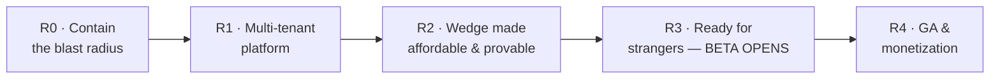
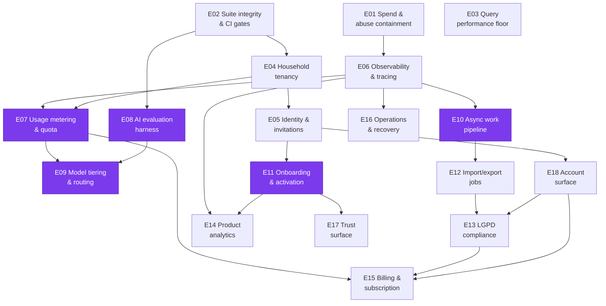

# Ledger Product Backlog — Single-User Tool → Ready-to-Market MVP

**Created:** 2026-08-07
**Baseline commit:** `3bbc5ca`
**Source of truth for architecture:** [`docs/architecture/product-readiness-review.md`](../architecture/product-readiness-review.md)

This backlog is written to be **consumed by AI agents**. Every epic file is self-contained: an agent opens exactly one file and has the outcome, the codebase evidence, the acceptance criteria, the verification commands, and the skill pipeline to run. No epic requires reading another epic to be actionable.

No story points. No timeframes. Releases are **gates**, not dates — a release opens when its epics' Definitions of Done pass.

---

## 1. Product decisions this backlog encodes

These were decided during brainstorming and are **not** open for re-litigation inside an epic. If an epic seems to contradict one, the decision wins.

| # | Decision | Consequence for the backlog |
|---|---|---|
| PD-1 | **The wedge is AI-first capture.** Conversational, voice, and receipt-OCR entry is the product, not a feature. | Open Finance auto-sync is explicitly **out of scope for MVP** (see §2). Epics that improve capture quality are wedge-critical and marked as such. |
| PD-2 | **Household tenancy from day 1.** | E04 is the largest epic and lands before any external user. Every subsequent epic assumes `request.household`, not `request.user`. |
| PD-3 | **Free capped beta → paid at GA.** | Metering and quotas ship in R1 (enforced, not charged). Billing lands in R4. |
| PD-4 | **Migrate to cheaper models, proven by evaluation.** | E08 (eval harness) gates E09 (model routing). A model swap without a score is forbidden. |
| PD-5 | **Backlog lives as repo markdown, mirrored to GitHub Issues.** | This directory is canonical. Issues are a view. Remote: `bessavagner/expense_tracker_v2`. |

### 2. Why Open Finance is out of scope (recorded so it stays settled)

The Brazilian incumbents sync 200+ institutions automatically: **Mobills at R$119,90/year** (~R$10/mo), Organizze on its paid plan. The aggregators that enable it cost **Pluggy ~R$2.500/mo, Belvo ~R$6.000/mo, Tecnospeed R$1.500 setup + R$540/mo**. At Mobills' price point that is ~250 paying subscribers just to clear Pluggy's floor, before OpenAI, Cloud Run, or Supabase.

**Ledger competes where Open Finance is structurally blind.** A bank feed yields `PAGUE MENOS R$87,43`. Ledger yields eleven items across four categories, with the discount prorated so the split sums to the amount paid. Same for the credit-card invoice cycle: Open Finance reports a transaction date; Brazilian users budget by *billing month*, which depends on the card's closing day.

Revisit only when MRR covers an aggregator floor with margin. Tecnospeed is the cheapest entry if that day comes.

---

## 3. Release map



| Release | Gate — the release opens when this is observably true |
|---|---|
| **R0 · Contain the blast radius** | An authenticated stranger cannot generate unbounded LLM spend, cannot write via an unprotected endpoint, and CI is green. |
| **R1 · Multi-tenant platform** | Two people share one ledger. A stranger can sign up, verify email, and reset a password. Every LLM call has a cost record attributed to a household. Production failures page you, not the customer. |
| **R2 · Wedge affordable & provable** | Receipt and chat quality are *scored* against real fixtures across models, and the production model mix costs a measured fraction of `gpt-5.4` with no score regression beyond an agreed threshold. |
| **R3 · Ready for strangers — BETA OPENS** | A new user reaches the activation event unaided. Import and export are durable. A data-subject request can be fulfilled in 15 days and a deletion honoured. Activation and D7 retention are instrumented. |
| **R4 · GA & monetization** | Someone pays in BRL, is charged correctly, hits a quota gracefully, and you can restore the database inside your stated RTO — rehearsed, not assumed. |

---

## 4. Epic index

`W` = wedge-critical (directly serves PD-1). Status starts `ready` for epics with no unmet dependency, `blocked` otherwise.

| ID | Epic | Rel | W | Depends on | Status |
|---|---|---|---|---|---|
| [E01](E01-spend-and-abuse-containment.md) | Spend & abuse containment | R0 | | — | **done** (2026-08-14) |
| [E02](E02-suite-integrity-and-ci-gates.md) | Suite integrity & CI gates | R0 | | — | **done** (2026-08-11) |
| [E03](E03-query-performance-floor.md) | Query performance floor | R0 | | — | review |
| [E04](E04-household-tenancy.md) | Household tenancy | R1 | | E02 | **done** (2026-08-13) |
| [E05](E05-identity-invitations-admin-isolation.md) | Identity, invitations & admin isolation | R1 | | E04 | **done** (2026-08-14) |
| [E06](E06-observability-and-agent-tracing.md) | Observability & agent tracing | R1 | | E01 | **done** (2026-08-14) |
| [E07](E07-usage-metering-and-quota.md) | Usage metering & quota | R1 | W | E04, E06 | **done** (2026-08-14)² |
| [E08](E08-ai-evaluation-harness.md) | AI evaluation harness | R2 | W | E02 | **done** (2026-08-14)³ |
| [E09](E09-model-tiering-and-routing.md) | Model tiering & routing | R2 | W | E07, E08 | ready⁴ |
| [E10](E10-async-work-pipeline.md) | Async work pipeline | R2 | W | E06 | ready |
| [E11](E11-onboarding-and-activation.md) | Onboarding & activation | R3 | W | E05 | ready |
| [E12](E12-durable-import-export-jobs.md) | Durable import/export jobs | R3 | | E10 | blocked |
| [E13](E13-lgpd-compliance.md) | LGPD compliance | R3 | | E12, E18 | blocked |
| [E14](E14-product-analytics.md) | Product analytics | R3 | | E06, E11 | ready¹ |
| [E15](E15-billing-and-subscription.md) | Billing & subscription | R4 | | E07, E13, E18 | blocked |
| [E16](E16-operations-staging-deploy-recovery.md) | Operations: staging, deploy, recovery | R4 | | E06 | ready |
| [E17](E17-trust-surface.md) | Trust surface: audit, error UX, landing | R4 | | E11 | blocked |
| [E18](E18-account-surface.md) | Account surface (Conta) | R3 | | E05 | ready |

### Defects

Numbered `D` and kept in the same self-contained format. A defect earns a file
when it changes what another epic should do; anything smaller is a commit.

| ID | Defect | Rel | W | Depends on | Status |
|---|---|---|---|---|---|
| [D01](D01-behaviour-harness-omits-the-receipt-draft.md) | Behaviour harness omits the `ReceiptDraft`, making receipt cases unpassable | R2 | W | E08 | ready⁵ |

### Dependency graph



**Critical path to beta:** `E02 → E04 → E05 → E11`. Everything else can proceed alongside it. **E03 and E01 are independent of everything** — start there for immediate risk reduction with no coordination cost.

² **E07 closed 2026-08-14 with one box unticked**, audited against `main` after the
E08 merge. Ten of eleven assertions map to named tests, listed inline in the epic.
The open one is *"the operator report shows p50/p90/p99 against real beta data"*:
the command, the percentiles and the per-kind breakdown all exist, but there is no
beta data yet, so the percentiles describe one household. Not a code gap. It closes
when the beta has run, which is also when the number is actually needed (to set a
price before GA). Same shape as E06's three open boxes.

³ **E08 closed 2026-08-14 with one box unticked.** The dataset has seven receipt
cases against a DoD of ten: only seven distinct receipts exist, and padding the set
would corrupt the baseline it produces. Baseline recorded for `openai:gpt-5.4` at
`docs/superpowers/evidence/eval/baseline-2026-08-14.md` (extraction 0.886 over five
runs, behaviour 0.810 over three). The harness paid for itself on its first real
run by refuting the gpt-5.6 swap staged mid-epic and by finding two provider
refusals that no test could reach.

⁵ **D01 should land before E09 measures anything behavioural.** It is small (create
one fixture row) and it is currently subtracting a fixed penalty from every model's
behavioural score, on the case most directly about the wedge. Behaviour reads 0.810
with it and 0.944 without.

⁴ **E09 is open, but do not start it with routing.** E08 measured a run-to-run
score spread of 0.14 on the seven-case set, which is *wider than the gap between
serious candidates* — in one pair of runs the leader and loser swapped. E09's DoD
requires "no score regression beyond an agreed threshold", and no honest threshold
is tighter than the noise today. **Widen the dataset to 10+ cases first**; that is
the cheapest way to shrink the spread, and every number E09 produces inherits it.
`gpt-5.6-luna` is already a measured candidate worth a real run: 0.656 at $0.023
per sweep against gpt-5.4's $0.187, which is the escalation-pipeline shape E09
wants.

¹ **E14 is `ready` by operator override (2026-08-14).** Its `depends_on` names E11,
which is still `ready` rather than `done`. The override is deliberate: E14's
*instrumentation* half depends only on E06, which is done. Its *activation-metric*
half genuinely needs E11's activation event definition, so an agent starting E14
before E11 lands must stop at that boundary rather than invent the event.

**E06 is done, so E07, E10, E14 and E16 are all open.** E06 closed with three
DoD boxes unticked — see its closing note; they need a real production error and
a real alert, neither of which is manufacturable on demand. Two of those gaps
(assistant turns/day, LLM spend/day on the golden-signals dashboard) are
*structurally* E07's work, not E06 debt.

**E05 is done, so E11 and E18 are both open.** E18 is small and off the critical path — it can run alongside E11 rather than ahead of it. Its `blocks` edges into E13 and E15 are *UI-surface* dependencies, not data ones: both later epics add a tab to E18's page instead of inventing an account surface of their own.

---

## 5. Epic file contract

Every `E**.md` in this directory has these sections, in this order. An agent can rely on them existing.

| Section | Purpose |
|---|---|
| YAML frontmatter | `id`, `title`, `release`, `status`, `depends_on`, `blocks`, `wedge_critical` |
| **Outcome** | One sentence, observable, in user or operator terms. Not a task list. |
| **Why now** | The forcing function. Cites the review finding ID (B1, H3, M4…). |
| **Evidence in the codebase** | `file:line` anchors, verified at commit `3bbc5ca`. Saves the agent a discovery pass. |
| **Stories** | `S<epic>-<n>`, each with Given/When/Then acceptance criteria. |
| **Definition of Done** | **Commands that must pass**, plus observable assertions. Not prose. |
| **Out of scope** | What an agent must NOT drag in. Prevents scope creep. |
| **Open questions** | Decisions the agent must surface rather than guess. |
| **Skill pipeline** | The exact skills to invoke, in order. |

### Status values

`ready` (dependencies met, may start) · `blocked` (dependency unmet) · `in-progress` · `review` (DoD passing, awaiting review) · `done`.

Update the epic's frontmatter **and** the table in §4 when status changes.

---

## 6. How an agent works an epic

```
1. Read docs/backlog/E<NN>-*.md            — the whole epic, one file
2. Read docs/architecture/product-readiness-review.md § cited by "Why now"
3. Confirm every depends_on epic is `done`  — if not, STOP and report
4. Run the epic's Skill pipeline, in order
5. The epic is done when its Definition of Done commands pass — no "should work"
```

### Default skill pipeline

Most epics use this. Deviations are stated in the epic's own **Skill pipeline** section.

| Step | Skill | Why |
|---|---|---|
| 1 | `superpowers:brainstorming` | **Only if the epic's Open questions are unresolved.** Otherwise skip — the epic *is* the spec. |
| 2 | `superpowers:writing-plans` | Turns the epic into `docs/superpowers/plans/YYYY-MM-DD-<epic>.md`. This is the existing convention — 20+ plans already there. |
| 3 | `superpowers:using-git-worktrees` | Isolation. Non-negotiable per project convention. |
| 4 | `superpowers:test-driven-development` | Red → green → refactor. Non-negotiable per project convention. |
| 5 | `superpowers:subagent-driven-development` | Executes the plan task-by-task. Use `superpowers:executing-plans` for a separate session instead. |
| 6 | `superpowers:requesting-code-review` | Separate reviewing pass — never self-approve in the authoring context. |
| 7 | `superpowers:verification-before-completion` | Evidence before assertions. Run the DoD commands and paste output. |
| 8 | `superpowers:finishing-a-development-branch` | Merge decision. |

**Security-touching epics** (E01, E04, E05, E07, E13) insert `/security-review` between steps 6 and 7.
**AI-quality epics** (E08, E09) insert `pm-ai-shipping:derive-tests` before step 2.
**UI epics** (E11, E17) insert `frontend-design` before step 4 and `oh-my-claudecode:visual-verdict` after.

---

## 7. Global constraints — apply to every epic

Violating any of these fails review regardless of whether the DoD passes.

1. **TDD.** Test first, always. Project convention, not a preference.
2. **Worktrees.** Feature work happens in an isolated worktree.
3. **The money boundary holds.** The LLM proposes structured intent; **Python computes every number**. No epic may move arithmetic into a prompt.
4. **Tenant scoping is centralized.** After E04, no epic may write `filter(user=...)` on a domain model. Use the household-scoped manager.
5. **Coverage gate.** `coverage report --fail-under=80` must keep passing.
6. **Lint gate.** `ruff check` and `ruff format --check` clean.
7. **No new secret in git.** Env var + Secret Manager, and `.env.example` updated.
8. **pt-BR in the product UI, English in code, comments, and docs.** Existing convention.
9. **Migrations are reversible** or the epic states explicitly why not.
10. **No time-bomb tests.** Any date-sensitive test freezes the clock. See E02.

### Verification commands (the vocabulary DoDs draw on)

```bash
# Full suite — local dev needs the pgvector container on :5433
POSTGRES_PORT=5433 uv run pytest src/backend/ -q

# Coverage gate
POSTGRES_PORT=5433 uv run coverage run -m pytest src/backend/ && uv run coverage report --fail-under=80

# Lint + format
uv run ruff check src/backend/ && uv run ruff format --check src/backend/

# Django checks — deploy variant catches production hardening regressions
uv run python src/backend/manage.py check
DEBUG=False SECRET_KEY=<50+ chars> ALLOWED_HOSTS=example.com \
  uv run python src/backend/manage.py check --deploy

# No missing migrations
uv run python src/backend/manage.py makemigrations --check --dry-run

# Real-LLM evaluation (opt-in, costs money)
RUN_LLM_TESTS=1 POSTGRES_PORT=5433 uv run pytest src/backend/assistant/tests/ -q
```

---

## 8. Mirroring to GitHub Issues

The repo is canonical; Issues are a view for tracking.

```bash
# One issue per epic, labelled by release
gh issue create --title "E04 · Household tenancy" \
  --body-file docs/backlog/E04-household-tenancy.md \
  --label "epic,R1"
```

Or use the `to-issues` skill over this directory. Keep the epic ID in the issue title — it is the join key. When an epic's status changes in frontmatter, reflect it on the issue.

---

## 9. What "ready to market" means here

The MVP is done when all five release gates in §3 pass. Concretely, borrowing the industry launch standard:

- **One core workflow** works unaided: photograph a receipt → confirm → it is correctly in the ledger, split by category, in the right billing month.
- **A defined activation event** exists and is measured (E11 sets it; E14 instruments it).
- **Four metrics** are live: exposure, activation rate, time-to-value, D7 retention.
- **Trust safeguards**: metered spend, tenant isolation, data export, deletion, a privacy policy, and a rehearsed restore.
- **Money works**: BRL, Pix + card, dunning tested end to end.

Anything not serving one of those five is post-MVP. Park it in §10.

---

## 10. Parked — explicitly post-MVP

Recorded so nobody rediscovers them mid-epic and treats them as gaps.

| Item | Why parked | Revisit when |
|---|---|---|
| Open Finance / bank aggregation | §2 — aggregator floor exceeds plausible MVP revenue | MRR covers an aggregator floor with margin |
| Internationalization (i18n catalogs, `gettext`) | Review M1. Brazil-only is a coherent strategy; pt-BR is hardcoded throughout | A non-BR market is a real target |
| Per-user currency & timezone | Review M2. Single-market MVP does not need it | Same trigger as i18n |
| Investment tracking, net worth, goals | Not the wedge. Incumbents' territory | Post-GA, if users ask |
| iOS native app | PWA + Android TWA cover the need today | iOS install friction proves to block conversion |
| Postgres Row-Level Security | Review ADR-001 alternatives — Supabase pooler makes per-transaction session vars unreliable | Defense-in-depth after E04, or after a Cloud SQL migration |
| Multi-region / HA | Single BR region is LGPD-friendly and adequate | Availability target rises above 99.9% |
| Receipt image retention for re-processing | Conflicts with privacy-by-default (media discarded today) | Only with explicit opt-in consent |
